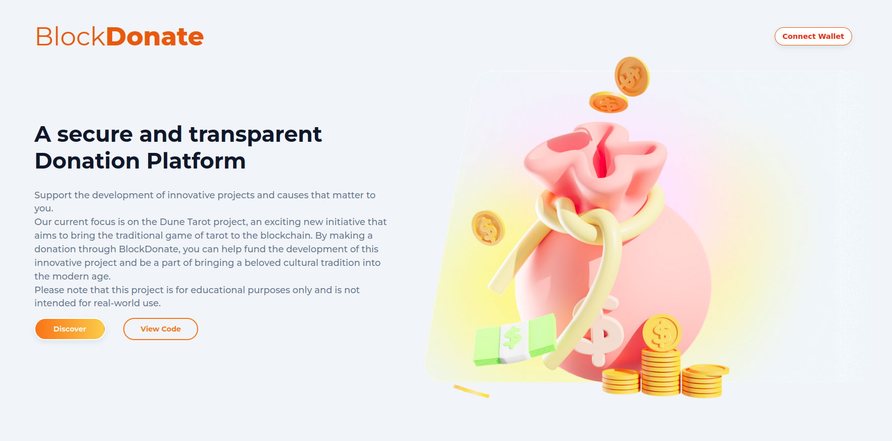

<a name="readme-top"></a>
[](https://github.com/julienbrs)
[![LinkedIn][linkedin-shield]][linkedin-url]

<!-- PROJECT LOGO -->
<br />
<div align="center">
  <a href="https://blockdonate.vercel.app/">
    
  </a>
  </a>
  <h3 align="center">
    <a href="https://blockdonate.vercel.app/">BlockDonate</a>
  </h3>
  </p>
</div>
<!-- TABLE OF CONTENTS -->
<summary>Table of Contents</summary>
<ol>
<li>
    <a href="#about-the-project">About The Project</a>
</li>
<li>
    <a href="#getting-started">Getting Started</a>
    <ul>
    <li><a href="#prerequisites">Prerequisites</a></li>
    <li><a href="#installation">Installation</a></li>
    </ul>
</li>
<li><a href="#contact">Contact</a></li>
</ol>
<br />
<!-- ABOUT THE PROJECT -->

## About The Project


This smart contract is for a decentralized crowdfunding application. It allows users to contribute to existing campaigns, and view the details of ongoing and past campaigns.

Test the dApp here: [Blockdonate](https://blockdonate.vercel.app/)

Check the frontend repo here: [Frontend repositorie](https://github.com/julienbrs/frontend-blockdonate)
<br />
<p align="center">
  
</p>
<p align="right">(<a href="#readme-top">back to top</a>)</p>

<!-- GETTING STARTED -->
## Getting Started

To get a local copy up and running follow these simple example steps.
### Prerequisites

    A web3 browser (e.g. MetaMask)
    An Ethereum wallet with some Goerli testnet Ether
    Hardhat framework to test and deploy

### Installation

Clone the repo

```sh
git clone https://github.com/julienbrs/hardhat-blockdonate
```

Install package dependencies using yarn
```sh
yarn
```


<p align="right">(<a href="#readme-top">back to top</a>)</p>


<p align="right">(<a href="#readme-top">back to top</a>)</p>

## Features

- Possibility to create your own campaign is coming
- A token reward system for contributors, where token rewards are allocated to contributors based on the proportion of their contributions to the total contributions of the campaign
- DAO with a voting system to ensure the successful delivery of the crowdfunding objective. This allows contributors to vote on the allocation and use of raised funds and ensures transparency and accountability within the crowdfunding process.

</br>

<!-- GOAL -->
## Goal

Please note that this dApp is built on the Goerli testnet and any transactions made will not result in real ether being transferred, and it's only for testing purposes.


<!-- CONTACT -->

## Contact

Bourseau Julien - _2nd year student at Ensimag, 2022_ - julien.bourseau@gmail.com

Project Link: [https://github.com/julienbrs/hardhat-blockdonate](https://github.com/julienbrs/hardhat-blockdonate)

<p align="right">(<a href="#readme-top">back to top</a>)</p>

[linkedin-shield]: https://img.shields.io/badge/-LinkedIn-black.svg?style=for-the-badge&logo=linkedin&colorB=555
[linkedin-url]: https://www.linkedin.com/in/julien-bourseau-ba2239228